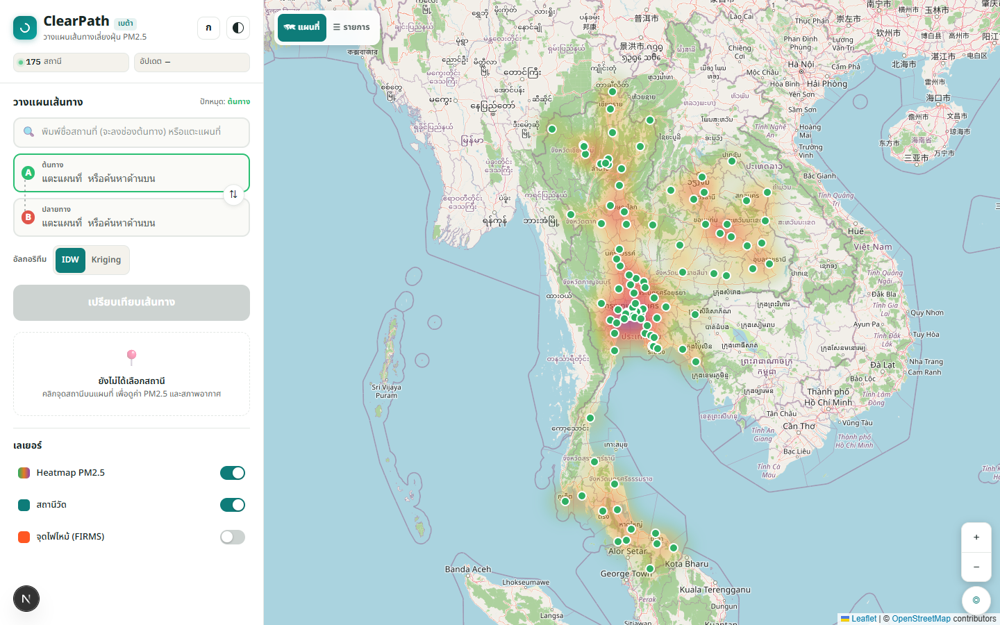

# ClearPath 🌬️

> วางแผนการเดินทางเพื่อลดการสัมผัสฝุ่น PM2.5
> Final Year Project · Computer Science

เปรียบเทียบ 2 เส้นทาง แล้วแนะนำเส้นที่ "รับฝุ่น PM2.5 น้อยที่สุด" จากข้อมูล real-time
ของสถานีวัดทั่วไทย ด้วย **IDW Spatial Interpolation** + แจ้งเตือนด้วยเสียงภาษาไทย (accessibility)



> UX/UI: civic-tech (teal + เอิร์ธโทน) · responsive desktop 2-คอลัมน์ / มือถือ bottom sheet
> · โหมดตัวอักษรใหญ่ + high-contrast · มุมมองรายการสำหรับ screen reader
> · AQI สื่อด้วย สี + ไอคอนรูปทรง + ข้อความ เสมอ (รองรับ color-blind)

---

## ✨ Features

| # | Feature | CS Contribution |
|---|---------|-----------------|
| 1 | แสดง PM2.5 real-time ~80 สถานี (heatmap) | Multi-source Data Fusion |
| 2 | เปรียบเทียบ 2 เส้นทาง → แนะนำเส้นฝุ่นน้อยกว่า | IDW Interpolation + Route Scoring (haversine) |
| 3 | อ่านผลออกเสียงภาษาไทย | Web Speech API (ผู้สูงอายุ/ผู้พิการทางสายตา) |
| 4 | **Confidence indicator** ต่อเส้นทาง | จัดการพื้นที่เซนเซอร์เบาบาง (ดู *Sparse-sensor handling*) |
| 5 | **ตรวจความแม่นยำ (LOOCV)** IDW vs Kriging vs baselines | Quantitative validation: RMSE/MAE/R²/skill ([`docs/evaluation.md`](docs/evaluation.md)) |
| 6 | **กราฟค่าฝุ่นตลอดเส้นทาง** (exposure profile) | Visualise per-route PM2.5 exposure |
| + | สภาพอากาศ · จุดไฟไหม้ (NASA FIRMS) · กราฟย้อนหลัง | — |

## 🏗️ Architecture

```
┌─────────── Vercel project เดียว (same-origin, ไม่มี CORS) ──────────┐
│   FRONTEND (Next.js 16)            BACKEND (FastAPI / Python)        │
│   app/ + frontend/                 api/index.py + backend/          │
│   ─ UI, Leaflet map, panels        ─ routers (HTTP boundary)        │
│   ─ เรียก /api/* เท่านั้น    ──▶    ─ services (air4thai, ORS, ...)   │
│                                    ─ algorithms (IDW/Kriging)       │
│                                    ─ Supabase access               │
└───────────────────────────────────────────┬─────────────────────────┘
                            cron รายชั่วโมง   │
        air4thai · ORS · OpenWeatherMap · NASA FIRMS · Nominatim
                                             │
                                        ┌────▼────┐
                                        │ Supabase│  (source of truth)
                                        └─────────┘
```

- **Dev:** `next dev` (:3000) proxy `/api/*` → `uvicorn` (:8000)
- **Prod:** Vercel route `/api/*` → Python function (ดู `vercel.json`)

## 🧰 Tech Stack

**Frontend:** Next.js 16 (App Router) · React 19 · TypeScript 5 · Tailwind CSS 4 · Leaflet 1.9 + react-leaflet 5 + leaflet.heat · Recharts
**Backend:** FastAPI · NumPy (IDW) · SciPy + PyKrige (Kriging, dev) · httpx · supabase-py
**Data:** Supabase (PostgreSQL) · **Deploy:** Vercel (frontend + Python function + Cron)

## 📁 Project Structure

```
app/         Next.js routing (page, layout) — บาง
frontend/    UI ทั้งหมด: components/ hooks/ lib/ types/
api/         Vercel Python entry (index.py)
backend/     FastAPI app: routers/ services/ algorithms/ models/ core/ tests/
supabase/    schema.sql
docs/        blueprint + design spec
```

## 🔑 Prerequisites — API keys (ฟรีทั้งหมด ไม่ต้องบัตรเครดิต)

| Service | สมัครที่ | หมายเหตุ |
|---------|---------|----------|
| OpenRouteService | openrouteservice.org/dev | 2,000 req/วัน |
| OpenWeatherMap | openweathermap.org/api | 1,000 calls/วัน |
| NASA FIRMS | firms.modaps.eosdis.nasa.gov/api | **อนุมัติ 1-2 วัน — สมัครก่อน** |
| Supabase | supabase.com | URL + service_role key |
| air4thai / Nominatim | — | ไม่ต้องสมัคร |

## 🚀 Setup

### 1) Frontend deps
```bash
npm install
```

### 2) Backend (Python venv)
```bash
py -3.12 -m venv .venv
.venv/Scripts/python -m pip install -r requirements-dev.txt   # มี Kriging + pytest
# (deploy ใช้ requirements.txt ที่เบากว่า)
```

### 3) Supabase
รัน `supabase/schema.sql` ใน Supabase SQL Editor (สร้างตาราง `stations`, `pm25_readings`)

### 4) Environment
```bash
cp .env.example .env.local   # แล้วเติมค่า key ทั้งหมด
```

## 🧑‍💻 Run (dev) — เปิด 2 terminal

```bash
# Terminal 1 — backend
.venv/Scripts/python -m uvicorn backend.main:app --reload --port 8000

# Terminal 2 — frontend (proxy /api → :8000 อัตโนมัติ)
npm run dev
```
เปิด http://localhost:3000

### Seed ข้อมูลครั้งแรก
แผนที่จะว่างจนกว่าจะ sync ข้อมูลเข้า Supabase — เรียก cron เองครั้งแรก:
```bash
curl http://localhost:3000/api/cron/sync
```
(ถ้าตั้ง `CRON_SECRET` ต้องส่ง `-H "Authorization: Bearer <secret>"`)

## ✅ Build & Test

```bash
npm run build          # production build + type check
npm run lint           # ESLint
.venv/Scripts/python -m pytest   # ทดสอบ algorithm core (IDW/haversine/resample/Kriging/LOOCV)

# ประเมินความแม่นยำ interpolation → docs/eval/ (ตาราง + รูป scatter)
.venv/Scripts/python scripts/evaluate_interpolation.py
```

## ☁️ Deploy (Vercel)

1. `vercel link` (หรือ import repo ใน dashboard)
2. ตั้ง Environment Variables ทั้งหมดจาก `.env.example` (ยกเว้น `BACKEND_ORIGIN`)
3. `vercel deploy --prod`

- `vercel.json` ตั้ง rewrite `/api/*` → Python function + **cron รายชั่วโมง** `/api/cron/sync`
- ⚠️ **Function size:** `requirements.txt` (deploy) ตัด scipy/pykrige ออกเพื่อกัน limit 250MB
  → production ใช้ **IDW**; Kriging รัน local/รายงานผ่าน `requirements-dev.txt`

## 🧮 Algorithm (CS core)

อยู่ใน `backend/algorithms/` — pure functions, unit-tested:
- `distance.py` — **Haversine** great-circle (แม่นกว่า Euclidean บน lat/lon)
- `idw.py` — IDW, k สถานีใกล้สุด (default 5), power 2 + `route_confidence()`
- `resample.py` — resample เส้นทางทุก ~500m (เพราะ ORS ไม่ได้คืนระยะเท่ากัน)
- `kriging.py` — Ordinary Kriging (variogram **exponential** — เลือกจาก sensitivity sweep) + fallback → IDW
- `validation.py` — **LOOCV** (RMSE/MAE/R²/skill) + baselines → ดู [`docs/evaluation.md`](docs/evaluation.md)

### Pipeline (ต่อ 1 เส้นทาง)
```
ORS route → resample ทุก 500m → IDW/Kriging ต่อจุด → avg/max PM2.5 → confidence
                                                          → เลือกเส้น avg ต่ำสุด
```

### Sparse-sensor handling (จุดเด่นเชิงวิชาการ)
เซนเซอร์ไม่ได้มีทุกจุด — **นี่คือเหตุผลที่ต้องมี spatial interpolation** ไม่ใช่ข้อจำกัด
จุดที่ไม่มีสถานีถูกประมาณค่าจากสถานีรอบข้าง (IDW/Kriging) และเรา**ระบุปริมาณความน่าเชื่อถือ**:
- แต่ละจุดบนเส้นทาง หาระยะถึงสถานีที่ใกล้ที่สุด (haversine)
- คะแนน = 1.0 ถ้า ≤ 5 กม. ไล่ลงเป็น 0.0 ที่ ≥ 25 กม. → เฉลี่ยทั้งเส้น = `confidence` (0–1)
- แสดงเป็นป้าย **สูง / ปานกลาง / ต่ำ** บนการ์ดเส้นทาง + เตือนเมื่อเส้นทางอยู่ไกลสถานี
- การ "เปรียบเทียบ" ทนต่อความคลาดเคลื่อนกว่าการ "ทำนายค่าจริง" (ต้องการแค่ลำดับที่ถูก)
- Kriging ให้ค่า variance (ความไม่แน่นอน) มาด้วย → เหตุผลว่าทำไมเป็น upgrade เหนือ IDW

## 🔌 API

| Method · Path | หน้าที่ |
|---|---|
| `GET /api/pm25/current` | สถานี + ค่าล่าสุด |
| `POST /api/route/compare` | เปรียบเทียบ 2 เส้นทาง |
| `GET /api/geocode?q=` | ค้นหาพิกัด |
| `GET /api/weather?lat&lon` | สภาพอากาศ |
| `GET /api/firms?days=` | จุดไฟไหม้ |
| `GET /api/history?station_id&hours` | ประวัติ PM2.5 |
| `GET /api/validate?method=` | ความแม่นยำ interpolation (LOOCV: IDW/Kriging/baselines) |
| `GET /api/cron/sync` | sync air4thai → Supabase (cron) |
| `GET /api/health` | health check |

- `POST /api/route/compare` คืนแต่ละเส้นทางพร้อม `confidence` (0–1) · `confidence_label` · `avg_nearest_km`
- **Caching:** `air4thai` (TTL 5 นาที) และ `ORS` (TTL 30 นาที, key ตามพิกัด) แบบ in-memory
  ลดการยิงซ้ำ/กัน rate-limit — ดู `backend/core/cache.py`

## 🛠️ Troubleshooting

- **แผนที่ว่าง / สถานี 0** → ยังไม่ได้ seed ข้อมูล, เรียก `/api/cron/sync`
- **503 จาก endpoint** → ยังไม่ได้ตั้ง env key ของ service นั้น
- **เปรียบเทียบเส้นทางไม่ได้** → เช็ค `ORS_API_KEY` + โควต้า ORS
- **ไม่มีเสียงไทย** → บางเครื่องไม่มี voice `th-TH` (จะใช้เสียง default แทน)

---

*ClearPath — Final Year Project · ดู design เต็มที่ `docs/superpowers/specs/`*
