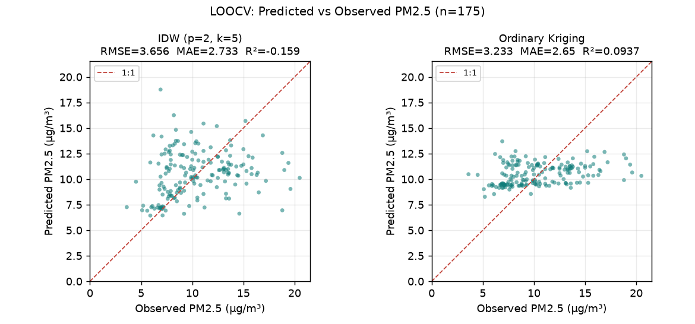

# ClearPath — Interpolation Accuracy (LOOCV)

- Generated: `20260626T022228Z` · stations used: **175** · data source: `supabase`
- Snapshot: `station_snapshot_20260626T022228Z.csv` (rerun on this file for deterministic results)
- Method: Leave-One-Out Cross-Validation — each station is held out and predicted from the rest.
- Metrics: RMSE/MAE in µg/m³; ME = bias; R² (1=perfect, 0=equals mean, <0=worse than mean); Skill = 1 − RMSE/RMSE_meanbaseline.

## 1. Method comparison

| วิธี | n | RMSE | MAE | ME (bias) | R² | Skill |
|---|---|---|---|---|---|---|
| IDW (p=2, k=5) | 175 | 3.656 | 2.733 | 0.052 | -0.159 | -7.1% |
| Ordinary Kriging (exponential) | 175 | 3.233 | 2.650 | 0.042 | 0.094 | +5.3% |
| Nearest (Thiessen) — baseline | 175 | 4.260 | 3.139 | 0.231 | -0.574 | -24.7% |
| Global mean — baseline | 175 | 3.415 | 2.808 | -0.000 | -0.011 | +0.0% |

## 2. IDW sensitivity — RMSE by power × k

| power \ k | 3 | 5 | 8 | 12 | 20 |
|---|---|---|---|---|---|
| **1** | 3.659 | 3.503 | 3.436 | 3.327 | 3.316 |
| **2** | 3.777 | 3.656 | 3.592 | 3.522 | 3.501 |
| **3** | 3.862 | 3.768 | 3.713 | 3.667 | 3.645 |

## 3. Kriging — RMSE by variogram model

| variogram | RMSE | MAE | R² |
|---|---|---|---|
| linear | 3.410 | 2.803 | -0.009 |
| spherical | 3.243 | 2.686 | 0.088 |
| exponential | 3.233 | 2.650 | 0.094 |
| gaussian | 3.268 | 2.696 | 0.074 |

